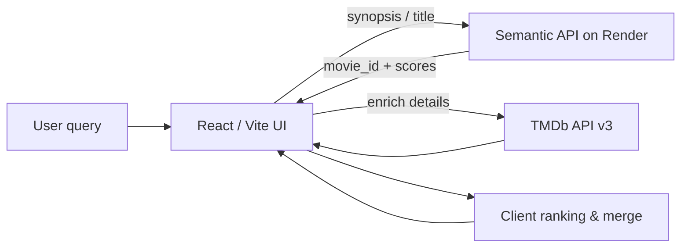

<p align="center">
  
</p>

<h1 align="center">CineScope Intelligence</h1>

<p align="center">
  <strong>React · Vite · BERT semantic search · TMDb enrichment</strong><br />
  <em>Cinematic UI for natural-language movie discovery and hybrid recommendations.</em>
</p>

<p align="center">
  <a href="https://github.com/sidnei-almeida/cinescope-semantic-discovery"><strong>View on GitHub</strong></a>
  &nbsp;·&nbsp;
  <a href="https://sidnei-almeida.github.io">Portfolio</a>
  &nbsp;·&nbsp;
  <a href="https://tmdb-semantic-recommender.onrender.com/health">Recommender API</a>
</p>

<p align="center">
  
  
  
  
  
  
</p>

---

## What this is

A **dark, cinema-noir discovery experience** that combines a semantic movie recommender with rich TMDb metadata. Users search by title, mood, or natural-language theme; the app surfaces a **featured spotlight**, a **hybrid recommendation grid**, and an editorial pipeline strip—without feeling like a generic SaaS dashboard.

This repository is the **frontend only**. It does not ship a backend: the browser calls external APIs (semantic model on Render + TMDb).

> **Production recommender:** `https://tmdb-semantic-recommender.onrender.com` — `POST /api/v1/recommend` with `synopsis`, `genre`, `year`, `title`, and `top_k`.

---

## Experience & workflow

The app is a **single-page vertical flow** (anchor navigation in the header):

| Section | Anchor | Purpose |
|---------|--------|---------|
| **Hero** | `#discover` | Cinematic backdrop, semantic search, quick thematic prompts |
| **Spotlight** | `#spotlight` | Featured film — poster, overview, cast, metrics, Watch Trailer |
| **Recommended For You** | `#movies` | Filterable grid (semantic + TMDb), sort, show more |
| **CineScope Engine** | `#about` | Minimal pipeline strip: Query → Semantic → TMDb → Ranked |
| **For Developers** | `#api` | Stack tags + sample recommender payload |



On first load, the app opens with a **default spotlight** (Frankenstein) so the page never feels empty.

---

## Main features

### Hero & search

- Full-width **cinematic hero** with warm vignette and champagne typography
- **Autocomplete** via TMDb search (debounced, smooth dropdown)
- **Thematic queries** sent directly to the semantic model (e.g. *mind-bending sci-fi about dreams*)
- Title searches resolve through TMDb first, then recommendations

### Featured spotlight

- Large **spotlight card** with poster, gradient title, genre chips, and score strip (TMDb rating, semantic match, popularity, year)
- **Starring** row with cast avatars
- **Watch Trailer** opens YouTube in a new tab (no embedded player inside the card)
- Default film on boot for demo/portfolio impact

### Recommended For You

- **Hybrid shelf:** up to **10 semantic** + up to **20 TMDb complement** titles, deduplicated
- **SEMANTIC** / **TMDb** source badges on each card
- Local **filters:** title search, source (All / Semantic / TMDb), sort (best match, year, rating, popularity)
- **Show more** pagination (10 at a time) in a responsive **5-column grid**

### Engine & developer strip

- Low-profile **CineScope Engine** pipeline (no heavy step cards)
- **For Developers** panel with stack chips and a sample `POST /api/v1/recommend` console

### Resilience

- **Render cold start** handling — wake banner, retries, health check
- **TMDb fallback** when the recommender is unavailable
- Placeholder posters and copy when enrichment fails (films still appear in the grid)

---

## Design system

Built for a **premium noir** mood: warm blacks, graphite cards, champagne gold accents—not blue/purple SaaS tones.

| Element | Implementation |
|---------|----------------|
| **Typography** | [Cormorant Garamond](https://fonts.google.com/specimen/Cormorant+Garamond) (display) + [Inter](https://fonts.google.com/specimen/Inter) (UI) + [JetBrains Mono](https://www.jetbrains.com/jetbrains-mono/) (API console) |
| **Palette** | Warm charcoal backgrounds, `--accent-gold` borders, ivory text (`src/styles/tokens.css`) |
| **Cards** | Gradient graphite panels, subtle gold borders, soft shadows |
| **Spotlight** | Multi-column layout with bookmark rail and backdrop accent |
| **Brand** | Custom **film projector** mark (`public/brand-projector.svg`) |

---

## Recommendation pipeline (client)

1. **Semantic API** — `POST /api/v1/recommend` with clean payload (`top_k` default **12**)
2. **Normalize** — `movie_id`, similarity score, title (defensive against `nan` / string IDs)
3. **TMDb enrich** — details, credits, videos per ID (failures keep the row, no silent drop)
4. **Hybrid merge** — semantic first, then TMDb similar/recommendations; tags `semantic_model` vs `tmdb_fallback`
5. **Rank** — hybrid re-ranking (BERT position + genre Jaccard + vote-aware tie-breaks)
6. **Render** — grid with filters and pagination

---

## Tech stack

| Layer | Choice |
|-------|--------|
| UI | React 19 |
| Build | Vite 8 |
| Styling | CSS tokens + layout (`tokens.css`, `layout.css`, `global.css`) |
| Icons | Lucide React |
| Data | `fetch` — `src/services/recommenderApi.js`, `tmdbApi.js`, `movieEnrichment.js` |
| Deploy | Static build on Vercel (`vercel.json` SPA rewrite) |

---

## Environment

Copy `.env.example` to `.env` (local only — **never commit** `.env`):

```env
# Dev: leave empty → Vite proxy /recommender (avoids CORS)
# Production (Vercel): set full Render URL
VITE_RECOMMENDER_API_URL=

VITE_TMDB_API_KEY=
VITE_TMDB_READ_TOKEN=
VITE_TMDB_IMAGE_BASE_URL=https://image.tmdb.org/t/p
```

| Variable | Description |
|----------|-------------|
| `VITE_RECOMMENDER_API_URL` | Semantic API base URL. **Dev:** empty uses `/recommender` proxy. **Prod:** `https://tmdb-semantic-recommender.onrender.com` |
| `VITE_RECOMMENDER_DIRECT` | `true` to bypass proxy in dev (may hit CORS on cold start) |
| `VITE_TMDB_API_KEY` | TMDb API key — posters, cast, trailers, metadata |
| `VITE_TMDB_READ_TOKEN` | Optional Bearer token instead of API key |
| `VITE_TMDB_IMAGE_BASE_URL` | Image CDN (default TMDb) |

---

## Quick start

```bash
git clone https://github.com/sidnei-almeida/cinescope-semantic-discovery.git
cd cinescope-semantic-discovery

npm install
cp .env.example .env    # add TMDb key for full enrichment

npm run dev
```

Open [http://localhost:5173](http://localhost:5173).

> **Note:** The Render recommender may sleep on the free tier. The first search can take **30–60 seconds**; the UI shows a wake-up notice and retries.

### Production build

```bash
npm run build
npm run preview
```

---

## Deploy on Vercel

1. Import this repository on [Vercel](https://vercel.com).
2. Framework preset: **Vite**
3. Build command: `npm run build` · Output directory: `dist`
4. Environment variables (Production):
   - `VITE_RECOMMENDER_API_URL` = `https://tmdb-semantic-recommender.onrender.com`
   - `VITE_TMDB_API_KEY` = your TMDb key
5. Deploy.

The dev server proxies `/recommender` → Render via `vite.config.js`; in production the browser calls the URLs from env directly.

---

## Repository structure

```
cinescope-semantic-discovery/
├── images/
│   └── header.png                 # README hero banner
├── public/
│   ├── brand-projector.svg        # Header / footer logo
│   ├── hero_image.png             # Hero background
│   └── favicon.*                  # App icons + web manifest
├── src/
│   ├── components/                # Hero, Spotlight, Grid, Engine, Technical, …
│   ├── services/                  # recommenderApi, tmdbApi, enrichment, ranking
│   ├── utils/                     # mappers, filters, fallbacks
│   ├── styles/                    # tokens, layout, global
│   └── config/                    # constants, credentials
├── tmdb-cinema/                   # Legacy vanilla reference (not used in build)
├── .env.example
├── vercel.json
└── vite.config.js                 # /recommender dev proxy
```

---

## API surface used by the UI

| Service | Examples |
|---------|----------|
| **Recommender** | `GET /health`, `POST /api/v1/recommend` |
| **TMDb** | `/search/movie`, `/movie/{id}`, credits, videos, recommendations, similar |

Payload example (also shown in the UI):

```json
{
  "synopsis": "A thief who steals corporate secrets through dreams…",
  "genre": "Action, Science Fiction",
  "year": 2010,
  "title": "Inception",
  "top_k": 12
}
```

---

## Related work

| Project | Role |
|---------|------|
| **This repo** | Cinematic discovery frontend (React + Vite) |
| [tmdb-semantic-recommender](https://tmdb-semantic-recommender.onrender.com) | BERT / FastAPI semantic API (hosted) |
| `tmdb-cinema/` (local) | Early vanilla prototype — logic migrated into `src/services/` |

---

## Disclaimer

Recommendations and similarity scores are for **demonstration and discovery only**. Poster art and metadata © [The Movie Database](https://www.themoviedb.org/). This product uses the TMDb API but is not endorsed or certified by TMDb.

---

## Author

**Sidnei Alves de Almeida**

- GitHub: [@sidnei-almeida](https://github.com/sidnei-almeida)
- Portfolio: [sidnei-almeida.github.io](https://sidnei-almeida.github.io)
