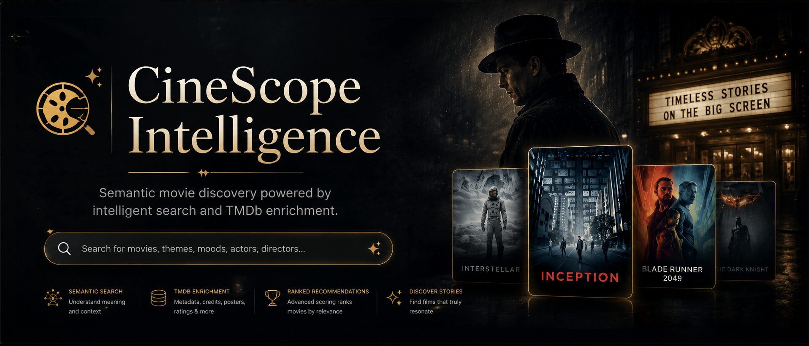
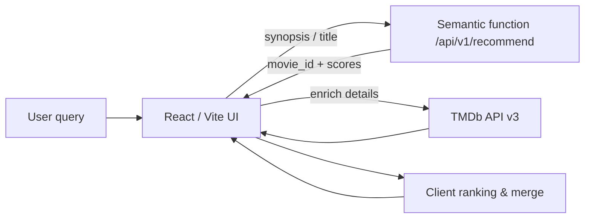

<p align="center">
  
</p>

<h1 align="center">CineScope Intelligence</h1>

<p align="center">
  <strong>React · Vite · ONNX semantic search on Vercel · TMDb enrichment</strong><br />
  <em>Cinematic UI for natural-language movie discovery and hybrid recommendations.</em>
</p>

<p align="center">
  <a href="https://github.com/sidnei-almeida/cinescope-semantic-discovery"><strong>View on GitHub</strong></a>
  &nbsp;·&nbsp;
  <a href="https://sidnei-almeida.github.io">Portfolio</a>
  &nbsp;·&nbsp;
  <a href="https://github.com/sidnei-almeida/tmdb-semantic-recommender">Model repository</a>
</p>

<p align="center">
  
  
  
  
  
  
</p>

---

## What this is

A **dark, cinema-noir discovery experience** that combines a semantic movie recommender with rich TMDb metadata. Users search by title, mood, or natural-language theme; the app surfaces a **featured spotlight**, a **hybrid recommendation grid**, and an editorial pipeline strip—without feeling like a generic SaaS dashboard.

This repository is **full stack**. The semantic engine runs as a Node serverless function in `api/`, deployed by Vercel alongside the static frontend, so the browser calls `/api/v1/recommend` on its own origin — no proxy, no CORS, no cold-start wake-up.

> **Endpoint:** `POST /api/v1/recommend` with `synopsis`, `genre`, `year`, `title`, and `top_k`. Health at `GET /api/health`.

---

## Experience & workflow

The app is a **single-page vertical flow** (anchor navigation in the header):

| Section | Anchor | Purpose |
|---------|--------|---------|
| **Hero** | `#discover` | Cinematic backdrop, semantic search, quick thematic prompts |
| **Spotlight** | `#spotlight` | Featured film — poster, overview, cast, metrics, Watch Trailer |
| **Recommended For You** | `#movies` | Filterable grid (semantic + TMDb), sort, show more |
| **CineScope Engine** | `#about` | Minimal pipeline strip: Query → Semantic → TMDb → Ranked |
| **For Developers** | `#api` | Stack tags + sample recommender payload |


```mermaid
flowchart LR
  USER[User query]
  UI[React / Vite UI]
  BERT[Semantic function /api/v1/recommend]
  TMDB[TMDb API v3]
  RANK[Client ranking & merge]

  USER --> UI
  UI -->|synopsis / title| BERT
  BERT -->|movie_id + scores| UI
  UI -->|enrich details| TMDB
  TMDB --> UI
  UI --> RANK --> UI
```

On first load, the app opens with a **default spotlight** (Frankenstein) so the page never feels empty.

---

## Main features

### Hero & search

- Full-width **cinematic hero** with warm vignette and champagne typography
- **Autocomplete** via TMDb search (debounced, smooth dropdown)
- **Thematic queries** sent directly to the semantic model (e.g. *mind-bending sci-fi about dreams*)
- Title searches resolve through TMDb first, then recommendations

### Featured spotlight

- Large **spotlight card** with poster, gradient title, genre chips, and score strip (TMDb rating, semantic match, popularity, year)
- **Starring** row with cast avatars
- **Watch Trailer** opens YouTube in a new tab (no embedded player inside the card)
- Default film on boot for demo/portfolio impact

### Recommended For You

- **Hybrid shelf:** up to **10 semantic** + up to **20 TMDb complement** titles, deduplicated
- A **TMDb** badge marks complement results; semantic matches are the unlabelled default
- Local **filters:** title search, source (All / Semantic / TMDb), sort (best match, year, rating, popularity)
- **Show more** pagination (10 at a time) in a responsive **5-column grid**

### Engine & developer strip

- Low-profile **CineScope Engine** pipeline (no heavy step cards)
- **For Developers** panel with stack chips and a sample `POST /api/v1/recommend` console

### Resilience

- **TMDb complement** when the semantic model returns too few visual candidates
- Placeholder posters and copy when enrichment fails (films still appear in the grid)
- A cold function instance answers in a few seconds; warm requests take ~40 ms

---

## Design system

Built for a **premium noir** mood: warm blacks, graphite cards, champagne gold accents—not blue/purple SaaS tones.

| Element | Implementation |
|---------|----------------|
| **Typography** | [Cormorant Garamond](https://fonts.google.com/specimen/Cormorant+Garamond) (display) + [Inter](https://fonts.google.com/specimen/Inter) (UI) + [JetBrains Mono](https://www.jetbrains.com/jetbrains-mono/) (API console) |
| **Palette** | Warm charcoal backgrounds, `--accent-gold` borders, ivory text (`src/styles/tokens.css`) |
| **Cards** | Flat graphite surfaces with hairline borders |
| **Spotlight** | Three columns — poster, film, cast — over a dimmed backdrop |
| **Brand** | Custom **film projector** mark (`public/brand-projector.svg`) |

---

## Recommendation pipeline (client)

1. **Semantic API** — `POST /api/v1/recommend` with clean payload (`top_k` default **12**)
2. **Normalize** — `movie_id`, similarity score, title (defensive against `nan` / string IDs)
3. **TMDb enrich** — details, credits, videos per ID (failures keep the row, no silent drop)
4. **Hybrid merge** — semantic first, then TMDb similar/recommendations; tags `semantic_model` vs `tmdb_fallback`
5. **Rank** — hybrid re-ranking (BERT position + genre Jaccard + vote-aware tie-breaks)
6. **Render** — grid with filters and pagination

---

## Tech stack

| Layer | Choice |
|-------|--------|
| UI | React 19 |
| Build | Vite 8 |
| Styling | CSS tokens + layout (`tokens.css`, `layout.css`, `global.css`) |
| Icons | Lucide React |
| Data | `fetch` — `src/services/recommenderApi.js`, `tmdbApi.js`, `movieEnrichment.js` |
| Engine | ONNX Runtime on Node (`api/index.js`, `api/_engine.js`) |
| Deploy | Vercel — static build plus one Node serverless function |

### Semantic engine

The engine used to be an Annoy index on a Render dyno. Annoy is a C++ extension with no
wheels, and its index was 132 MB, so neither could travel into a serverless function.
`scripts/export_index.py` reads the Annoy file directly and writes the artifacts in
`api/model/`:

| Artifact | Size | Purpose |
|----------|------|---------|
| `encoder.onnx` | 23 MB | INT8-quantized `all-MiniLM-L6-v2` |
| `vocab.txt` | 0.2 MB | WordPiece vocabulary (30,522 tokens) |
| `embeddings.i8.bin` | 23 MB | 62,368 × 384 per-row quantized int8 vectors |
| `scales.f32.bin` | 0.2 MB | Per-row dequantization scales |
| `ids.i32.bin` | 0.2 MB | Row → TMDb id |
| `meta.jsonl` + `meta.offsets.i64.bin` | 6.7 MB | Title/year/poster/genres, seekable by row |

Search is now an **exact** cosine scan over every vector (a chunked typed-array pass, ~40 ms)
rather than Annoy's approximate tree walk, so results are strictly better than before —
the source film itself now reliably ranks first for its own synopsis. Quantization costs
almost nothing: cosine fidelity against the original float vectors is 0.99997 on average.

Tokenization is a WordPiece implementation in plain JavaScript (`api/_tokenizer.js`),
because the runtime has no tokenizer library and one short string per request does not
need one. `npm run check:tokenizer` asserts token-for-token parity against a fixture
frozen from the reference tokenizer, covering accents, CJK, punctuation and truncation
edges — a single token of drift would move every query vector.

Inference uses **`onnxruntime-node`, not `onnxruntime-web`**. The WASM build is far
smaller, but its int8 kernels disagree with the native CPU ones: measured over 120
queries, WASM produced query vectors at 0.99 cosine from the reference and only **84% of
each top-10 survived**. The index was built against the native kernels, so the query
encoder has to use them too. With native inference the match is exact — cosine 1.000000
against the original Python implementation, at 8 ms per query.

The deployed function comes to **95 MB** (43 MB ONNX Runtime for linux/x64, 52 MB of
artifacts) against Vercel's 250 MB limit. Two things keep it there, and both are load
bearing:

- `vercel.json` excludes the four platforms the deployment cannot run. The npm package
  bundles binaries for five, 283 MB installed.
- `ONNXRUNTIME_NODE_INSTALL_CUDA=skip` is set on the project. Without it the installer
  adds CUDA execution providers to the linux build, which take that directory from
  67 MB to 263 MB and push the function past the limit on its own.

If a deploy ever fails on function size, suspect a stale build cache before suspecting
the code: a cache populated before the CUDA setting was in place keeps serving the
bloated tree, and `vercel deploy --force` is what clears it.

---

## Environment

Copy `.env.example` to `.env` (local only — **never commit** `.env`):

```env
# Leave empty — the engine is served from this same deployment at /api.
# Set it only to point a local build at a remote deployment.
VITE_RECOMMENDER_API_URL=

VITE_TMDB_API_KEY=
VITE_TMDB_READ_TOKEN=
VITE_TMDB_IMAGE_BASE_URL=https://image.tmdb.org/t/p
```

| Variable | Description |
|----------|-------------|
| `VITE_RECOMMENDER_API_URL` | Optional override. **Leave empty** — the app calls `/api` on its own origin |
| `VITE_TMDB_API_KEY` | TMDb API key — posters, cast, trailers, metadata |
| `VITE_TMDB_READ_TOKEN` | Optional Bearer token instead of API key |
| `VITE_TMDB_IMAGE_BASE_URL` | Image CDN (default TMDb) |

---

## Quick start

```bash
git clone https://github.com/sidnei-almeida/cinescope-semantic-discovery.git
cd cinescope-semantic-discovery

npm install
cp .env.example .env    # optional — a project TMDb key is bundled

# Terminal 1 — semantic engine on :8000
npm run api

# Terminal 2 — Vite dev server, proxies /api to :8000
npm run dev
```

Open [http://localhost:5173](http://localhost:5173).

The frontend runs without the engine — search falls back to TMDb discovery — but the
semantic grid needs `npm run api`.

### Production build

```bash
npm run build
npm run preview
```

---

## Deploy on Vercel

1. Import this repository on [Vercel](https://vercel.com).
2. Framework preset: **Vite** — Vercel detects `api/index.js` and builds it as a Node function.
3. Build command: `npm run build` · Output directory: `dist`
4. Environment variables (Production): `VITE_TMDB_API_KEY` (optional — a project key is bundled).
5. Deploy.

`vercel.json` routes `/api/*` to the function and everything else to the SPA, and
`includeFiles` ships `api/model/` with it. `vite.config.js` proxies `/api` to a local
`npm run api` server during development.

---

## Repository structure

```
cinescope-semantic-discovery/
├── images/
│   └── header.png                 # README hero banner
├── public/
│   ├── brand-projector.svg        # Header / footer logo
│   ├── hero_image.png             # Hero background
│   └── favicon.*                  # App icons + web manifest
├── api/                           # Vercel Node serverless function
│   ├── index.js                   # Routes and validation
│   ├── _engine.js                 # Encoder + exact vector search
│   ├── _tokenizer.js              # WordPiece
│   └── model/                     # ONNX encoder, vocab, int8 index, metadata
├── scripts/
│   ├── export_index.py            # Annoy index → int8 artifacts (one-off)
│   ├── build_brand_assets.py      # Brand SVG → favicons, PWA icons, .ico
│   ├── dev-api.mjs                # Runs the handler behind a local HTTP server
│   ├── check_tokenizer.mjs        # Parity test vs the reference fixture
│   └── reference/                 # Reference tokenizer + fixture (test only)
├── src/
│   ├── components/                # Hero, Spotlight, Grid, Engine, Technical, …
│   ├── services/                  # recommenderApi, tmdbApi, enrichment, ranking
│   ├── utils/                     # mappers, filters, fallbacks
│   ├── styles/                    # tokens, layout, global
│   └── config/                    # constants, credentials
├── .env.example
├── vercel.json
└── vite.config.js                 # /api dev proxy
```

---

## API surface used by the UI

| Service | Examples |
|---------|----------|
| **Recommender** | `GET /api/health`, `POST /api/v1/recommend` |
| **TMDb** | `/search/movie`, `/movie/{id}`, credits, videos, recommendations, similar |

Payload example (also shown in the UI):

```json
{
  "synopsis": "A thief who steals corporate secrets through dreams…",
  "genre": "Action, Science Fiction",
  "year": 2010,
  "title": "Inception",
  "top_k": 12
}
```

---

## Related work

| Project | Role |
|---------|------|
| **This repo** | Cinematic discovery frontend **and** the semantic engine it runs on |
| [tmdb-semantic-recommender](https://github.com/sidnei-almeida/tmdb-semantic-recommender) | Training pipeline and the source Annoy index / model release |

---

## Disclaimer

Recommendations and similarity scores are for **demonstration and discovery only**. Poster art and metadata © [The Movie Database](https://www.themoviedb.org/). This product uses the TMDb API but is not endorsed or certified by TMDb.

---

## Author

**Sidnei Alves de Almeida**

- GitHub: [@sidnei-almeida](https://github.com/sidnei-almeida)
- Portfolio: [sidnei-almeida.github.io](https://sidnei-almeida.github.io)
