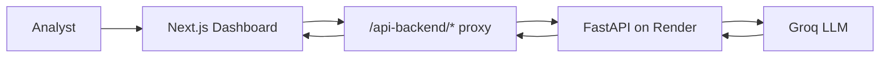

<p align="center">
  
</p>

<h1 align="center">Corporate Signal Intelligence Dashboard</h1>

<p align="center">
  <strong>Next.js · TypeScript · Tailwind · Recharts · Groq briefings</strong><br />
  <em>Executive UI for ML anomaly detection across monitored public issuers.</em>
</p>

<p align="center">
  <a href="https://github.com/sidnei-almeida/corporate-signal-intelligence-dashboard"><strong>View on GitHub</strong></a>
  &nbsp;·&nbsp;
  <a href="https://github.com/sidnei-almeida/corporate-signal-intelligence">Backend API</a>
  &nbsp;·&nbsp;
  <a href="https://corporate-signal-intelligence.onrender.com/docs">API docs (OpenAPI)</a>
</p>

<p align="center">
  
  
  
  
  
  
  
  
</p>

---

## What this is

A **dark, glass-style executive dashboard** that consumes the [Corporate Signal Intelligence](https://github.com/sidnei-almeida/corporate-signal-intelligence) FastAPI backend. It turns Isolation Forest scores, rule-based anomaly types, and issuer metadata into an analyst workflow: scan the universe, drill into a ticker, inspect signal drivers, and generate **Groq-powered executive memos** from a selected event.

The UI does **not** talk to PostgreSQL directly. Every panel loads data through the production API (or a local proxy in development).

> **Production API:** `https://corporate-signal-intelligence.onrender.com` — see the [backend README](https://github.com/sidnei-almeida/corporate-signal-intelligence) for pipelines, notebooks, and Neon.

---

## Pages & workflow

| Route | Purpose |
|-------|---------|
| **Overview** `/` | KPI strip, ML pipeline status, anomaly type distribution, company risk ranking, top events preview |
| **Anomalies** `/anomalies` | Filterable event queue, selected anomaly detail, summary table |
| **Companies** `/companies` | Issuer selector, intelligence profile, signal breakdown chart, anomaly timeline |
| **AI Briefings** `/briefings` | Event context panel, one-click Groq memo generation, markdown reader + insight sidebar |



---

## Main features

### Executive overview

- **KPI cards** — monitored companies, total anomalies, average anomaly rate, highest-risk ticker, model availability
- **ML Pipeline card** — artifact status, API health pills, engine metadata, pipeline flow tags, signal stack (Stooq · SEC EDGAR · Isolation Forest · Groq)
- **Anomaly Type Distribution** — horizontal bar chart with uniform cyan → blue gradient on every bar
- **Company Risk Ranking** — top issuers by anomaly rate
- **Top anomaly events** — sortable preview table with severity and type chips

### Investigation & issuer views

- **Severity badges** — `Critical` · `High` · `Medium` · `Low` with dedicated color tokens (red / amber / green)
- **Anomaly type chips** — `Price Spike`, `Volume Spike`, `Filing Activity`, `Revenue Shift`, `Combined Signal`, and more
- **Signal metrics** — daily return, volume/return z-scores, volatility, filing counts, revenue QoQ, margins
- **Interactive timeline** — anomaly score over time; severity-colored scatter points; click to select for briefing
- **Company signal breakdown** — per-type frequency bars + signal profile metrics

### AI briefings

- Select any anomaly row or timeline point
- **Generate AI Briefing** calls `POST /briefings/generate` with structured context
- Markdown memo with risk interpretation, monitoring checklist, and evidence snapshot
- Model name and generation timestamp in the toolbar

### System indicators

- Boot screen while `/health` warms up (Render free tier)
- **API Online** / **Artifact loaded** status pills with live dot pulse
- Loading and error states with retry on data hooks

---

## Design system

Built for long monitoring sessions: low-glare dark base, cyan accent, glass cards, and monospace data.

| Element | Implementation |
|---------|----------------|
| **Typography** | [Syne](https://fonts.google.com/specimen/Syne) (UI) + [JetBrains Mono](https://www.jetbrains.com/plex/mono/) (scores, tickers, tables) via `next/font` |
| **Cards** | Frosted panels — `rgba(255,255,255,0.028)` background, cyan border, `backdrop-filter: blur(12px)` |
| **Metric cells** | Subtle inner tiles — no heavy teal fills; hover brightens border only |
| **Charts (Recharts)** | Horizontal bar gradient `#00D4FF` → `#0066FF` on **all** bars; line/area charts in cyan; severity legend unchanged on timeline scatter |
| **Severity badges** | CSS classes `severity-badge-critical` / `-high` / `-moderate` — not reused for chart series colors |
| **Pipeline tags** | Cyan pill labels for steps like *Market Signals → SEC Filings → ML Score → AI Briefing* |
| **Status pills** | Green glow for healthy API / artifact states |

Tokens live in `src/app/globals.css`, `src/lib/cardVisuals.ts`, and `src/lib/chartTheme.ts`.

---

## Severity & anomaly types

Scores map to severity tiers for badges and risk labels:

| Severity | Typical use in UI |
|----------|-------------------|
| **Critical** | Lowest scores · highest priority |
| **High** | Elevated deviation |
| **Medium** / **Low** | Moderate monitoring |

Rule-based **anomaly types** (from the backend) appear as chips and chart categories, for example:

`revenue_shift` · `filing_activity` · `high_volatility` · `volume_spike` · `price_spike` · `negative_margin` · `combined_signal`

---

## Tech stack

| Layer | Choice |
|-------|--------|
| Framework | Next.js 15 (App Router) |
| Language | TypeScript |
| Styling | Tailwind CSS v4 + CSS variables |
| Charts | Recharts 3 |
| Icons | Lucide React |
| Markdown | `react-markdown` + `remark-gfm` (briefings) |
| Data | REST via `src/lib/api.ts` + Next.js rewrites |

---

## Environment

Create `.env.local` (see `.env.example`):

```env
NEXT_PUBLIC_API_URL=https://corporate-signal-intelligence.onrender.com
```

The app rewrites browser requests to `/api-backend/*` → your API URL, avoiding CORS issues in dev and on Vercel.

---

## Quick start

```bash
git clone https://github.com/sidnei-almeida/corporate-signal-intelligence-dashboard.git
cd corporate-signal-intelligence-dashboard

npm install
cp .env.example .env.local   # adjust API URL if needed

npm run dev
```

Open [http://localhost:3000](http://localhost:3000).

> **Note:** If the Render API has slept, the first load may take **30–60 seconds**. The boot screen explains the wake-up delay.

### Production build

```bash
npm run build
npm start
```

---

## Deploy on Vercel

1. Import this repository on [Vercel](https://vercel.com).
2. Framework preset: **Next.js**
3. Environment variable:
   - `NEXT_PUBLIC_API_URL` = `https://corporate-signal-intelligence.onrender.com` (or your own API host)
4. Deploy.

API traffic is proxied through the Next.js host (`next.config.ts` rewrites), so the browser never needs direct CORS access to Render.

---

## Repository structure

```
corporate-signal-intelligence-dashboard/
├── images/
│   └── header.png              # README hero
├── src/
│   ├── app/                    # Routes: /, /anomalies, /companies, /briefings
│   ├── components/
│   │   ├── layout/             # AppShell, Header, Sidebar
│   │   ├── dashboard/          # Charts, tables, memo, pipeline card
│   │   └── ui/                 # Card, Badge, Button, Select, …
│   ├── contexts/               # DashboardContext (health, model)
│   ├── hooks/                  # Data hooks per page
│   └── lib/                    # api, types, formatters, chartTheme, cardVisuals
├── README_model.md             # Style reference for this README
├── .env.example
└── next.config.ts              # API proxy rewrites
```

---

## API surface used by the UI

| Area | Examples |
|------|----------|
| System | `GET /health` |
| Companies | `GET /companies`, profiles & summaries |
| Anomalies | `GET /anomalies`, `/top`, `/summary`, `/types`, per-ticker |
| Model | `GET /model/info` |
| Briefings | `POST /briefings/generate` |

Full contract: [OpenAPI docs](https://corporate-signal-intelligence.onrender.com/docs).

---

## Related repositories

| Project | Role |
|---------|------|
| [corporate-signal-intelligence](https://github.com/sidnei-almeida/corporate-signal-intelligence) | FastAPI, ML pipeline, Neon, Groq, notebooks |
| **This repo** | Frontend dashboard |

---

## Disclaimer

Model scores and Groq-generated text are for **analytical monitoring and portfolio demonstration only**. They are not investment advice, legal opinions, or official SEC filing interpretations. Always validate against primary sources.

---

## License & author

**[MIT License](LICENSE)**

**Sidnei Alves de Almeida** — [@sidnei-almeida](https://github.com/sidnei-almeida)
